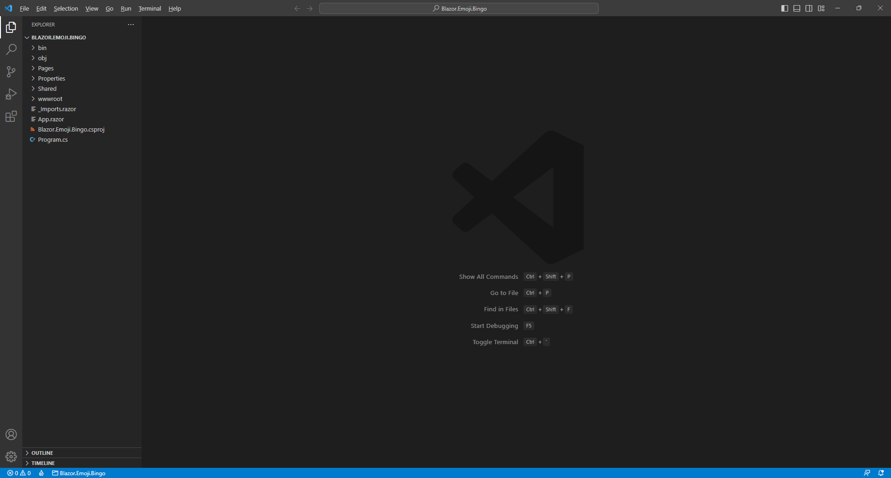
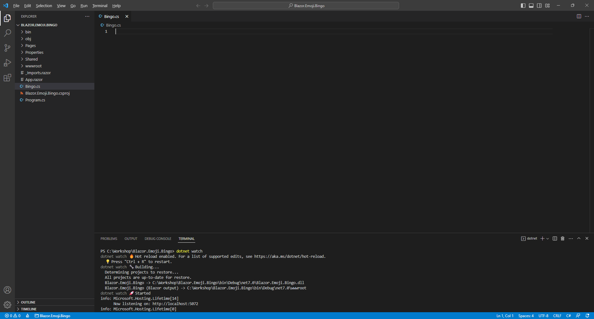

# Blazor Emoji Bingo


## Code

You can **Clone** or **Download** this **Repository** from **GitHub** for the **Code** for the **Workshop**

## Setup

### .NET

**.NET** includes **Blazor** so you will need to **Download** and **Install** the latest version of the **.NET SDK** , which if you don't have it already you can **Download** it for **Windows** or **Mac** using a **Browser** from [dot.net](https://dot.net/)


Once the **Installer** has been **Downloaded** open or run it to begin **Installation** of the **.NET SDK** then follow the steps in the **Installation Wizard**


### Visual Studio Code

**Visual Studio Code** is a free **Integrated Development Environment or IDE** created by **Microsoft** and will be used in the **Workshop** and will make writing the **Project** easier. You can **Download** it, if you don't have it already,for **Windows** or **Mac** using a **Browser** from [code.visualstudio.com](https://code.visualstudio.com/)


Once the **Installer** has been **Downloaded** open or run it to begin **Installation** of **Visual Studio Code** then follow the steps in the **Installation Wizard**


Once you've installed **.NET** and **Visual Studio Code** then you are ready for the rest of the **Workshop**.

### Project

Once the **.NET SDK** and **Visual Studio Code** is **Installed** , then if using a **Mac** , you then need to go to **Finder** then search for **Terminal** and then select it, or if using **Windows** ,you need to go to **Start** then search for **Command Prompt** and then select it, so it launches as follows:


Once in the **Command Prompt** or **Terminal** you will create a new **Project** with the **.NET CLI** that was **Installed** as part of the **.NET SDK**. To create the new **Project** in **Command Prompt** or **Terminal** type or *Copy* and *Paste* the following command and then press **Enter** :

```
dotnet new blazorwasm -o Blazor.Emoji.Bingo
```

This will create a **Project** for **Blazor** using **WebAssembly** or **wasm** for **Blazor.Emoji.Bingo**. Once this **Project** has been created in the **Command Prompt** or **Terminal** you will need to change to the **Folder** using **cd** for the **Workshop** by typing in the following and then press **Enter**:

```
cd Blazor.Emoji.Bingo
```

Please make a note of the **Folder** where you have created the **Project** e.g., *C:\Workshop\Blazor.Emoji.Bingo* for later in the **Workshop**.

### Package

While still in the **Command Prompt** or **Terminal** you will add the **Package** for the **Emoji** that will be used in **Blazor.Emoji.Bingo** type or *Copy* and *Paste* the following command and then press **Enter** :

```
dotnet add package Comentsys.Assets.FluentEmoji.Shaded
```

> **Information** -This will add the **Package** for *Comentsys.Assets.FluentEmoji.Shaded* created by *Peter Bull* to the **Project** that contains the open-source **Fluent Emoji** created by **Microsoft** in a 3D or **Shaded** style.

### Workspace

While still in the **Command Prompt** or **Terminal** to open the **Workspace** for the **Project** type or *Copy* and *Paste* the following command and then press **Enter**:

```
code .
```

Once **Visual Studio Code** has opened select the **Yes, I trust the authors** option in the **Do you trust the authors of the files in this folder?** if this is displayed and then you can close the **Command Prompt** or **Terminal** as it is no longer needed in the **Workshop**.


### Extension

Then in **Visual Studio Code** select **Extensions** from the **Sidebar** search for **C#** and then select **Extension** for **C#** from **Microsoft** which should be as follows and select **Install** if not done already:


Once the **Extension** has been **Installed** then select **Explorer** from the **Sidebar** in **Visual Studio Code**.



Once you have **.NET** and **Visual Studio Code** installed, have created the **Project**, added the **Package**, opened **Visual Studio Code** and installed the **Extension** then you have finished the **Setup** of the **Workshop**, otherwise check over everything, then you are ready for the **Build** part of the **Workshop**!

## Build

### Blazor

**Blazor** was created by **Microsoft** allows you to build interactive web applications using **C#** , **HTML** and **CSS** that supports both **Client** using **Web Assembly** in the **Browser** and **Server** using **ASP.NET**.


> **Information** - **Blazor** allows you to develop web applications where you can run your code directly on the **Client** in the **Browser** using **WebAssembly** or run your code on the **Server** where events are passed to the **Client** using **SignalR**. You can even re-use code between **Client** and **Server**. You can find out more about **Blazor** including documentation, examples and more at [blazor.net](https://blazor.net/)

### Start

If you have completed **Setup** already but don't have **Visual Studio Code** with the **Project** open, then if using **Windows,** you need to go to **Start** then search for **Visual Studio Code** and then select it or on **Mac** locate it using **Finder** , then from the **Menu** choose **File** then **Open Folder...** then select the **Folder** for your **Project** e.g., *C:\Workshop\Blazor.Emoji.Bingo* and once opened in **Visual Studio Code** from the **Sidebar** select the **Explorer** which will be the icon with two pages.

If you have completed **Setup** but do have **Visual Studio Code** with the **Project** open, then in **Visual Studio Code** select **Terminal** and then **New Terminal** and then once the **Terminal** has appeared type in the following command and then press **Enter** :

```
dotnet watch
```

Once this is done **Visual Studio Code** will **Build** the **Project** and display it in a **Browser** as follows:


If you don't see anything like this in a **Browser** or have any problems, then check over anything you might have missed in any previous steps. Otherwise, you have successfully started the **Project** in your **Browser** , you will need to make sure to keep this **Browser** open throughout the **Workshop**.

If you accidentally close the **Browser** then you can return to **Visual Studio Code** and select the **Terminal** and then press **Ctrl+C** in **Windows** or **Command+C** on **Mac** on the **Keyboard** and then in the **Terminal** type **dotnet watch** again which should relaunch the **Browser** or if you close **Visual Studio Code** then you can just launch **Visual Studio Code** again then from the **Terminal** type **dotnet watch** to launch the **Browser**.

### File

Within **Visual Studio Code** from the **Explorer** move the **Cursor** over **Blazor.Emoji.Bingo** you will see a **New File…** option, if you select this and then type in the name as follows and then press **Enter** :

```
Bingo.cs
```

Once you press **Enter** after typing in the name you should see a blank *Bingo.cs* or you can select it from the **Explorer** in **Visual Studio Code** so you can see it as follows:



Should you make any mistakes with the **C#** in this **Workshop** then you will see **Errors** in the **Terminal** when you **Save** any changes. So if you see any **Errors** double check you haven't missed anything, the key thing to remember is balance, you will be using a lot of curly braces that open like so **{** but will always have a counterpart of **}** this also applies to square brackets that will have both **[** and **]** and rounded brackets of **(** and **)** so it is a good idea to check if these are balanced, if you see any double-quotes or **"** then you should always expect to see another **"** nearby. Where you see any semi colons or **;** remember to include them, sometimes the smallest mistake that is easy to fix makes it work once corrected!

Should you make any mistakes with the **HTML** or **Razor** these may be harder to spot and may just not look correct in the **Browser** so make sure any angled brackets you see should open with **\<** then you should expect to see **\>** nearby although you might see one on their own in **C#** but for **C#** that's okay!

**Errors** will give you an idea of where to look for the mistake, they will often give a line number which you can check against the value shown at the bottom of **Visual Studio Code** you can always *Copy* and *Paste* any code in the **Workshop** but read through what you copied to see if you understand what it is doing!

**Warnings** may appear at certain **Steps**, but you will resolve these in later **Steps** of the Workshop.

### Using, Namespace & Classes

While still in **Visual Studio Code** at the top of *Bingo.cs* from **Explorer** type or *Copy* and *Paste* the following:

```csharp
using Comentsys.Assets.FluentEmoji;
namespace Blazor.Emoji.Bingo;

public class Column
{
    public Column(FluentEmojiType primary, FluentEmojiType secondary) =>
        (Primary, Secondary) = (primary, secondary);

    public FluentEmojiType Primary { get; set; }

    public FluentEmojiType Secondary { get; set; }
}

public class Row
{
    public List<Column> Columns { get; set; } = new();
}

public class Display
{
    public List<Row> Rows { get; private set; } = new();
}

// Bingo Class
```

> **Information** – Functionality from the **Package** of `Comentsys.Assets.FluentEmoji.Shaded` that was added is included at the top of the `class` with the `using` for `Comentsys.Assets.FluentEmoji` which is the `namespace` for the **Package**. **Namespaces** in **C#** are used to group related functionality together such as the `namespace` for `Blazor.Emoji.Bingo`. There is also a `class` for `Column` , `Row` and `Display`. In **C#** a `class` represents something or an **Object** in such a `Row` or `Column`. The `Column` contains the **Emoji** with a `Primary` and `Secondary` one which are represented by `FluentEmojiType` and uses a **Constructor** of `Column(FluentEmojiType primary, FluentEmojiType secondary)` to set those values which is Finally, there is a **Comment** which is anything with `//` in front of it, such as **// Bingo Class** below which another `class` will be defined in the next part of the **Workshop**.

If you are typing anything in, then please check everything has been typed in exactly or you can *Copy* and *Paste* something instead. In **C#** casing matters, for example **comentsys.assets.fluentemoji** is wrong but **Comentsys.Assets.FluentEmoji** is correct.

You don't have to worry about indentation in **C#** but if you need to **Format** anything you have typed or *Copy* and *Pasted* in **Visual Studio Code** , you can do so with **Shift+Alt+F** on **Windows** or **Shift+Option+F** on **Mac** or right-click in any **File** and select **Format Document**.

While still in **Visual Studio Code** for _Bingo.cs_ you will define the structure of the main `class` for the game. There are **Comments** or lines beginning with `//` included to help you put things in the right place later in the **Workshop**. So below the **Comment** of `// Bingo Class` type or *Copy* and *Paste* in the following:

```csharp
public class Bingo
{
    // Constants

    // Members

    // Properties

    // Choose & Get Methods

    // Swap Method

    // Layout Method

    // Call Method

    // Callback Method

    // Ready Method

    // New Method & Constructor

}
```

You can then go to the **Menu** in **Visual Studio Code** and select **File** and then **Save All** , you may see in the **Terminal** a message saying **Do you want to restart your app - Yes (y) / No (n) / Always (a) / Never (v)?** you can select the **Terminal** then type **y** for **Yes** or **a** for **Always** to keep what you have done so far.

### Program

In **Visual Studio Code** you will see *Program.cs* in the **Explorer** , select it and it should be like the following:


Within *Program.cs* above **await builder.Build().RunAsync();** type or *Copy* and *Paste* the following:

```csharp
builder.Services.AddSingleton<Bingo>();
```

> **Information** - This will add the `class` of **Bingo** to be available to the **Dependency Injection** system used in **Blazor**. **Dependency Injection** allows specific functionality to be provided anywhere that needs it which will be the **Page** used later in the **Workshop**. In **C#** an **Instance** of a `class` is needed for it to be used but by adding the `class` this way we can get **Dependency Injection** to do it for us, if you want to know more about **Dependency Injection** you can read up on it after you have completed the **Workshop**.

At this point you should have created a **File** called *Bingo.cs* with contents including the **class** for **Column** , **Row** and **Display** along with the structure of one for **Bingo** and modified *Program.cs* to include it. You can go over any previous steps and check you've done everything correctly then continue with the **Workshop**.

### Constants

From within **Visual Studio Code** and **Explorer** select *Bingo.cs* then once selected you will define some **Constants** by typing or *Copy* and *Paste* below the **Comment** of `// Constants` the following:

```csharp
private const int size = 5;
private const int rows = 10;
private const int columns = 9;
private const int delay = 3;
private const int minimum = 1;
private const int maximum = 90;
```

> **Information** - **Constants** are defined with `const` and these are things that will not change during the game such as the minimum and maximum values for the game of **Bingo**. All the **Constants** are using `int` for numbers and these values will only be used inside the `class` so are declared with `private`, once you have finished playing the game as-is you could change these values to vary the rules such as how many **Emoji** to use, how they are displayed and more!

### Members

While still in *Bingo.cs* in **Visual Studio Code** you will define some **Members** by typing or *Copy* and *Paste* below the **Comment** of `// Members` the following:

```csharp
private FluentEmojiType[] _displayEmoji = Array.Empty<FluentEmojiType>();
private FluentEmojiType[] _currentEmoji = Array.Empty<FluentEmojiType>();
private List<int> _currentValues = new();
private List<int> _displayValues = new();
private Timer? _timer;
private int _interval;
private int _index;
```

> **Information** - **Members** represent values in `class` also known as **Variables** as these will change during the game, these are only used within the `class` so are marked `private`. The **Members** with `FluentEmojiType[]` will represent the **Emoji** needed as an **Array** which is a list of items with a fixed size and those with `List<int>` represent lists of numbers that could vary in length and with those with `int` represent a single number. There is also a `Timer` which is used to trigger parts of the game automatically.

You can then go to the **Menu** in **Visual Studio Code** and select **File** and then **Save All** , you may see in the **Terminal** a message saying **Do you want to restart your app - Yes (y) / No (n) / Always (a) / Never (v)?** you can select the **Terminal** then type **y** for **Yes** or **a** for **Always** to keep what you have done so far.

### Properties

While still in *Bingo.cs* in **Visual Studio Code** you will define some **Properties** by typing or *Copy* and *Paste* below the **Comment** of `// Properties` the following:

```csharp
public int Players { get; set; } = 1;

public int Player { get; set; } = 1;

public int Winner { get; set; } = -1;

public int Countdown { get; set; }

public long Value { get; set; }

public bool IsReady { get; set; }

public string? Message { get; set; }

public Action? Updated { get; set; }

public Display Display { get; set; } = new();

public Display Current { get; set; } = new();

public List<List<int>> Tickets { get; set; } = new();
```

> **Information** - **Properties** also represent values within a `class` and these are used outside the `class` so are marked `public`. **Properties** like these are used as **Blazor** can detect changes in them to update the **Page** in the **Browser**. The **Properties** here will be values needed by the game including `Value` which can store larger numbers known as `long` and there is a `bool` which can be `true` or `false`. There are also **Properties** for `Action`, you will see how this is used later, along with ones that use the `class` of `Display` that was defined earlier in the **Workshop**. You'll also notice some of them have a `?` in them, this denotes these can have no value at all which in **C#** is called `null` , there is also `new` which is used to create an **Instance** of the `class`. Some **Properties** such as `Players`, `Player` and `Winner` have values set to them for **Default** values.

You can then go to the **Menu** in **Visual Studio Code** and select **File** and then **Save All** you may see in the **Terminal** a message saying **Do you want to restart your app - Yes (y) / No (n) / Always (a) / Never (v)?** you can select the **Terminal** then type **y** for **Yes** or **a** for **Always** to keep what you have done so far.

### Choose & Get Methods

While still in *Bingo.cs* in **Visual Studio Code** you will define some **Methods** by typing or *Copy* and *Paste* below the **Comment** of `// Choose & Get Methods` the following:

```csharp
private static List<int> Choose(int total, int value)
{
    var random = new Random(value);
    return Enumerable.Range(minimum, maximum)
    .OrderBy(r => random.Next(minimum, maximum))
    .Take(total).ToList();
}

private static FluentEmojiType[] Get(List<int> values)
{
    var emoji = Enum.GetNames<FluentEmojiType>()
    .Where(item => item.Contains("Face"))
    .Select(Enum.Parse<FluentEmojiType>).ToArray();
    return values.Select(value => emoji[value]).ToArray();
}
```

> **Information** - **Methods** of `Choose` and `Get` will only be used within the `class` so are declared with `private`. These **Methods** also are marked as `static` as they don't deal with **Members** or **Properties** which would require an **Instance**. A **Method** is where some functionality can be defined as a block that can either be self-contained with `void` or can `return`. The first **Method** is used to get a list of numbers and then order these in a reasonably random way - there is some control over this which is intentional and is a key part of making the game work as intended. The other **Method** is used to generate a list of **Emoji** , in this case it is just those that contain a **Face** so they are a bit more recognisable and will get these based on a list of values that have been provided. Both **Methods** use **LINQ** in **C#** such as `Where` and `Select` which makes the behaviour of the **Methods** a lot easier to implement and easier to understand what they are doing. Also used in these **Methods** is `var` which is where the **Type** such as `Random` or `FluentEmojiType[]` is inferred.

## Swap Method

While still in *Bingo.cs* in **Visual Studio Code** you will define another **Method** by typing or *Copy* and *Paste* below the **Comment** of `// Swap Method` the following:

```csharp
private static void Swap(Display display, FluentEmojiType emoji, bool swapPrimary)
{
    var query = display.Rows.SelectMany(r => r.Columns);
    var column = swapPrimary ?
    query.FirstOrDefault(c => c.Secondary == emoji) :
    query.FirstOrDefault(c => c.Primary == emoji);
    if (column != null)
    {
        (column.Primary, column.Secondary) =
        (column.Secondary, column.Primary);
    }
}
```

> **Information** - This **Method** is used to switch around the values of the **Properties** of `FluentEmojiType` for a `Column` , the first thing it does is use **LINQ** to first collect up all the **Columns** from all the **Rows** then based upon the `bool` for `isPrimary` when this is `true` it will perform the first action after the question mark or `?` or should it be `false` it will perform the second action after the colon or `:` instead. This is used to get the correct `Column` to be swapped around, this is done by using a **Tuple** which can represents a set of values in **C#** used here to swap the values around. There may not be a **Column** that matches so it will be `null` so we check it is not equal to `null` with `!=` before swapping otherwise an **Error** would occur when swapping.

### Layout Method

While still in *Bingo.cs* in **Visual Studio Code** you will define another **Method** by typing or *Copy* and *Paste* below the **Comment** of `// Layout Method` the following:

```csharp
private static void Layout(Display display, int rows, int columns, 
    FluentEmojiType[]? list, FluentEmojiType item, bool isPrimary)
{
    if (rows * columns == list?.Length)
    {
        int index = 0;
        display.Rows.Clear();
        for (int r = 0; r < rows; r++)
        {
            var row = new Row();
            for (int c = 0; c < columns; c++)
            {
                var primary = isPrimary ? list[index] : item;
                var secondary = isPrimary ? item : list[index];
                row.Columns.Add(new Column(primary, secondary));
                index++;
            }
            display.Rows.Add(row);
        }
    }
}
```

> **Information** - This **Method** is used to set up the **Instance** of the `class` for `Display` it will use a list along with a single `FluentEmojiType` and will provide either one for a `Column` making use of `?` and `:` with the `isPrimary` value and then creates the appropriate `Row` with `new` along with the `Column` using the **Constructor** with the `FluentEmojiType` provided.

You can then go to the **Menu** in **Visual Studio Code** and select **File** and then **Save All** , you may see in the **Terminal** a message saying **Do you want to restart your app - Yes (y) / No (n) / Always (a) / Never (v)?** you can select the **Terminal** then type **y** for **Yes** or **a** for **Always** to keep what you have done so far.

### Call Method

While still in *Bingo.cs* in **Visual Studio Code** you will define another **Method** by typing or *Copy* and *Paste* below the **Comment** of `// Call Method` the following:

```csharp
private void Call()
{
    Swap(Display, _displayEmoji[_index], true);
    Swap(Current, _displayEmoji[_index], false);
    var call = _displayValues[_index];
    Tickets.ForEach(w => w.Remove(call));
    Winner = Tickets.FindIndex(w => !w.Any()) + 1;
    if (Winner > 0)
    {
        Message = Winner == Player ?
        $"Your Player {Player} Bingo!" :
        $"Your Player {Player} Lost, Player {Winner} Bingo!";
        _timer?.Dispose();
    }
}
```

> **Information** - This **Method** is used to represent the "call" from a **Bingo** game, it will use the **Method** of `Swap` to show the **Emoji** for the value that was displayed and the current one for the player that should be hidden. It will update the **Property** for `Tickets` which will be used to show the progress by removing one of the matching numbers with `Remove`. Then it will check for a winner with `Any` to look for a ticket without any values as that will be the winner and set a message with who won and reset the `Timer` with `Dispose`.

### Callback Method

While still in *Bingo.cs* in **Visual Studio Code** you will define another **Method** by typing or *Copy* and *Paste* below the **Comment** of `// Callback Method` the following:

```csharp
private void Callback(object? state)
{
    if(Countdown < 0)
    {
        if(_interval >= delay)
        {
            if(_index < maximum)
            {
                Call();
                _interval = 0;
                _index++;
            }
        }
        else
        {
            _interval++;
        }
    }
    else
    {
        Countdown--;
    }
    Updated?.Invoke();
}
```

> **Information** - This **Method** will be used with the `Timer` and will be triggered every *1,000* milliseconds or once per second. The first thing this **Method** does is check `if` the `Countdown` is over, when it is it will check `if` the `_interval` value is more or equal to `delay`, then it checks if the `_index` which is how far into the game we are is less than the `maximum`. When this is the case the **Method** for `Call` will be invoked then the `_interval` will be reset to `0` and `_index` will be incremented by one with `++`. There is also when `Countdown` is not less than `0` then the **Method** will reduce the value of `Countdown` by one with `--`. The final thing this **Method** does is perform `Invoke` on the `Action` for the **Property** of `Updated`.

You can then go to the **Menu** in **Visual Studio Code** and select **File** and then **Save All** , you may see in the **Terminal** a message saying **Do you want to restart your app - Yes (y) / No (n) / Always (a) / Never (v)?** you can select the **Terminal** then type **y** for **Yes** or **a** for **Always** to keep what you have done so far.

### Ready Method

While still in *Bingo.cs* in **Visual Studio Code** you will define another **Method** by typing or *Copy* and *Paste* below the **Comment** of `// Ready Method` the following:

```csharp
public void Ready()
{
    _index = 0;
    _interval = 0;
    Winner = -1;
    Tickets = new();
    Countdown = (int)(new DateTime(Value) - DateTime.UtcNow).TotalSeconds;
    _displayValues = Choose(maximum, (int)Value);
    _displayEmoji = Get(_displayValues);
    for (int i = 0; i < Players; i++) 
    {
        Tickets.Add(Choose(size * size, i));
    }
    if (Player - 1 < Players)
    {
        _currentValues = Tickets[Player - 1];
        _currentEmoji = Get(_currentValues);
        Layout(Display, rows, columns, _displayEmoji, 
            FluentEmojiType.HollowRedCircle, false);
        Layout(Current, size, size, _currentEmoji, 
            FluentEmojiType.CrossMark, true);
        _timer = new Timer(Callback, null, 0, 1000);
        IsReady = true;
    }
}
```

> **Information** - This **Method** will be used to begin the game, it will set or reset values used which includes `Countdown` which will be based on the difference between the value it uses and the current time with `DateTime.UtcNow` which does not consider a time zone so will be similar for every player. This **Method** also uses the **Methods** for `Choose` and `Get` along with `Layout` to setup the game of **Bingo** and the `Timer` which will invoke the **Method** of `Callback` every *1,000* milliseconds or once per second.

### New Method & Constructor

While still in *Bingo.cs* in **Visual Studio Code** you will define a **Method** and **Constructor** by typing below the **Comment** of `// New Method & Constructor` the following:

```csharp
public void New()
{
    _timer?.Dispose();
    IsReady = false;
    Value = DateTime.UtcNow.AddMinutes(1).Ticks;
}

public Bingo() => New();
```

**Information** - **Method** of `new` is used to begin a new game and is used by the **Constructor** which sets up the `class`. It also sets the **Value** to one minute in the future for when the **Countdown** should complete to play the game.

You can then go to the **Menu** in **Visual Studio Code** and select **File** and then **Save All** you may see in the **Terminal** a message saying **Do you want to restart your app - Yes (y) / No (n) / Always (a) / Never (v)?** you can select the **Terminal** then type **y** for **Yes** or **a** for **Always** to keep what you have done so far.

### Asset Component

Within **Visual Studio Code** from the **Explorer** and move the **Cursor** over the **Blazor.Emoji.Bingo** you will see a **New File…** option, select this then type in the name as follows and then press **Enter** :

```
Asset.razor
```

This will form the basis of a **Razor Component** which is also known as a **Blazor Component** in **Blazor** or just as **Component** in this **Workshop**, you should have a blank **Component** as follows:


> **Information** - **Components** allow you to reuse or define either some functionality or some **Razor** and **HTML** to create a piece or **Component** of an application that you can see in **Blazor** with this one being used to output an **Emoji**.

Within *Asset.razor* in **Visual Studio Code** you can define the **Component** by typing in or *Copy* and *Paste* the following:

```razor
@using Comentsys.Toolkit;
@Svg
@code
{
    internal MarkupString Svg { get; set; } = new();

    [Parameter]
    public AssetResource AssetResource { get; set; } = new();


    protected async override Task OnParametersSetAsync()
    {
        using var reader = new StreamReader(AssetResource.Stream);
        Svg = new MarkupString(await reader.ReadToEndAsync());
    }
}
```

> **Information** - The first part of this **Component** is a `using` for `Comentsys.Toolkit` which is another **Package** that is used by the **Package** of `Comentsys.Assets.FluentEmoji.Shaded` then there is the output of the **Property** for `MarkupString` and there is also a **Property** for `AssetResource` which is set with a **Parameter** passed to the **Component** which will invoke the **Method** for `OnParametersSetAsync` which has been overridden, denoted with `override` , to provide the functionality to display the `AssetResource` for the **Emoji**.

You can then go to the **Menu** in **Visual Studio Code** and select **File** and then **Save All** you may see in the **Terminal** a message saying **Do you want to restart your app - Yes (y) / No (n) / Always (a) / Never (v)?** you can select the **Terminal** then type **y** for **Yes** or **a** for **Always** to keep what you have done so far.

### Output Component

Within **Visual Studio Code** from the **Explorer** and move the **Cursor** over the **Blazor.Emoji.Bingo** you will see a **New File…** option, select this and then type in the name as follows and then press **Enter** :

```
Output.razor
```

This will form the basis of another **Component** which should be blank as follows:


> **Information** - This **Component** will be used to show the *Rows* and *Columns* of **Emoji**.

Then within *Output.razor* in **Visual Studio Code** you can define this **Component** by typing in or *Copy* and *Paste* the following:

```razor
@using Comentsys.Assets.FluentEmoji;
@for (int r = 0; r < Value.Rows.Count; r++)
{
    <div class="row">
        @for (int c = 0; c < Value.Rows[r].Columns.Count; c++)
        {
            <div class="col-sm text-center">
<Asset AssetResource="@ShadedFluentEmoji.Get(Value.Rows[r].Columns[c].Primary)" />
            </div>
        }
    </div>
}
@code
{
    [Parameter]
    public Display Value { get; set; } = new();
}
```

> **Information** - This **Component** will use the other **Component** of `Asset` to create the visual layout with a `for` loop with the `class` of `Display` to show the `Rows` then another `for` loop to show the `Columns` with the **Emoji** using `ShadedFluentEmoji`.

You can then go to the **Menu** in **Visual Studio Code** and select **File** and then **Save All** you may see in the **Terminal** a message saying **Do you want to restart your app - Yes (y) / No (n) / Always (a) / Never (v)?** you can select the **Terminal** then type **y** for **Yes** or **a** for **Always** to keep what you have done so far.

### Index Page

Within **Visual Studio Code** from the **Explorer** for **Blazor.Emoji.Bingo** open **Pages** by selecting the **>** next to it and select **Index.razor**, here you will see what is currently being displayed in the **Browser** as follows:


You will need to remove everything from **Index.razor** so it appears as follows:


Within *Index.razor* in **Visual Studio Code** you can define a new **Page** by typing in or *Copy* and *Paste* the following which will also include some **Comments** to help you place things later in the **Workshop** :

```razor
@page "/"
@inject Bingo bingo;

<!-- Title -->

@if (bingo.IsReady)
{
    @if (bingo.Countdown > 0)
    {
        <h2>@bingo.Countdown</h2>
    }
    else
    {
        <div class="container">
            <!-- Container -->

        </div>
    }
}
else
{
    <!-- Form -->

}
@code
{
    protected override void OnInitialized() =>
    bingo.Updated = () => this.StateHasChanged();
}
```

> **Information** - This updated **Page** provides the **Instance** of `Bingo` using **Dependency Injection** then there is section where the **Title** will go then there is a check for `IsReady` and should this be `true` then the next part will happen which is a check that `Countdown` is greater than zero the value will be displayed otherwise the *Container* section will be shown. However, should `IsReady` be `false` then the section for *Form* will be used instead. There is also **Code** for the **Page** which includes a **Method** where the implementation of which has been overridden to provide our own denoted with `override` in this case it is for `OnInitialized` which is called when the **Page** is first loaded, and this will be used to connect the `Action` of `Updated` to the **Method** of `StateHasChanged` so that when `Updated` is triggered this will force **Blazor** to update the **Page** with the latest changes to any **Properties**. **Comments** here are **HTML** ones like `<!-- Comment -->` instead of `// Comment` that are used in **C#**.

### Index Title

While still within *Index.razor* in **Visual Studio Code** below the **Comment** of `<!-- Title --\>` type in or *Copy* and *Paste* the following:

```razor
<PageTitle>Blazor Emoji Bingo</PageTitle>

<h1>
    Blazor Emoji Bingo 
    <button class="btn btn-primary" @onclick="@bingo.New">New</button>
</h1>
```

**Information** -This will define a **Title** to be displayed in the tab or title bar of the **Browser** along with one to be displayed on the **Page** itself along with a **Button** that can be used to start a new game when clicked which is done by assigning the **Event** of **onclick** for the **button** to the **Method** of **New**.

## Index Container

While still within *Index.razor* in **Visual Studio Code** below the **Comment** of `<!— Container --\>` type in or *Copy* and *Paste* the following:

```razor
@if (bingo.Winner > 0)
{
    <div class="row alert alert-success" role="alert">
        @bingo.Message
    </div>
}
<div class="row">
    <div class="col-6">
        <Output Value="@bingo.Display" />
    </div>
    <div class="col-6">
        <span class="badge bg-secondary">
            <strong>@bingo.Player</strong>
        </span>
        <Output Value="@bingo.Current" />
    </div>
</div>
<div class="row row-cols-sm-6">
    @for (int i = 0; i < bingo.Tickets.Count; i++)
    {
        <div class="col">
            <div class="badge bg-secondary">
                <strong>@(i + 1)</strong> 
                @(bingo.Tickets[i].Count)TG
            </div>
        </div>
    }
</div>
```

> **Information** - The first section of the **Page** within the **Container** is for the **Winner** of the game which will be indicated when the value is greater than or equal to zero, if so, it will show the `Message` which will be either the message if you have won or who has won if you lost. The next section is the look-and-feel of the game itself with the **Component** of **Output** used to display the **Emoji** being called and the current player's **Emoji**. The final section is to display the progress of the game for all players by outputting the values of `Tickets` which will indicate how many **Emoji** a player has to go before they win the game or *TG*.

### Index Form

Finally, while still within *Index.razor* in **Visual Studio Code** below the **Comment** of `<!-- Form -->` type in or *Copy* and *Paste* the following:

```razor
<form @onsubmit="bingo.Ready">
    <div class="form-group">
        <label>Total Players</label>
        <input type="text" class="form-control" @bind="bingo.Players" />
    </div>
    <div class="form-group">
        <label>Player</label>
        <input type="text" class="form-control" @bind="bingo.Player" />
    </div>
    <div class="form-group">
        <label>Value</label>
        <input type="text" class="form-control" @bind="bingo.Value" />
    </div>
    <button class="btn btn-success m-2">Ready</button>
</form>
```

> **Information** - This `form` will begin the game when submitted which is done by assigning the **Event** of `onsubmit` for the `form` to the **Method** of **Ready**. This `form` uses binding with `bind` for each of the **Properties** of `Players` , `Player` and `Value` so that when these are typed into each `input` on the `form` those values are captured, and the **Properties** set accordingly which are then used by the game.

If you need to **Format** anything you have *Copy* and *Pasted* in **Visual Studio Code** , you can do so with **Shift+Alt+F** on **Windows** or **Shift+Option+F** on **Mac** or right-click in any **File** and select **Format Document**.

You can then go to the **Menu** in **Visual Studio Code** and select **File** and then **Save All** you may see in the **Terminal** a message saying **Do you want to restart your app - Yes (y) / No (n) / Always (a) / Never (v)?** you can select the **Terminal** then type **y** for **Yes** or **a** for **Always** to keep what you have done so far.

You can check the **Browser** to see if updated, if not then in **Visual Studio Code** select the **Terminal** and then press **Ctrl+C** in **Windows** or **Command+C** on **Mac** on the **Keyboard** and then in the **Terminal** type **dotnet watch** again which should relaunch the **Browser** or if you close **Visual Studio Code** then you can just launch **Visual Studio Code** again then from the **Terminal** type **dotnet watch** to launch the **Browser**.

You have finished the **Build** of the **Workshop** and can **Play** the game using **Single Player** or **Multi Player**!

## Play

### Single Player

Once you have completed the **Setup** and **Build** of the **Workshop** , if you return to the **Browser** and you don't see anything or there are any **Errors** , then check that you've completed each part of the **Workshop** correctly and double-check that what you have is the same – remember the **Tips & Tricks** might help with anything that was missed, otherwise in the **Browser** you should see something like the following:


You can play the game on your own in **Single Player** by pressing **Ready** then wait for the **Countdown** to complete, then the game will start, and you should see something like the following:


You will see an **Emoji** appear where each **Red Circle** is every few seconds on the left and if one matches yours on the right then you will see it replaced by a **Red Cross** , you can see how many are to go at the bottom and when you match all twenty-five then you'll win, however you always win in **Single Player**!

### Multi Player

**Multi Player** makes it is possible for everyone to experience the same game as random numbers on computers are not truly random, so can take advantage of this by using the same values for everyone, although you have your own ticket. First collect a list of names with a number next to each one, the number next to your name will be what you need for **Player** and the last number next to a name will be what you need for **Total Players** then you should start a game or select **New** then enter those numbers. For a two-player game for **Player 1** needs to have **Player** as **1** and **Total Players** as **2** and will look like as follows:


**Player 1** can share their **Value** with **Player 2** and then select **Ready**. Then **Player 2** should have **Player** as **2** and **Total Players** as **2** and will _Copy_ and _Paste_ the **Value** from **Player 1** and this should look like as follows:


Once **Player 2** has entered **Total Players** , **Player** and **Value** then they can also select **Ready.**

Then both **Player 1** and **Player 2** will see a **Countdown** after which the game will begin. Also make sure to always keep the **Browser** visible during a game, after playing a game for a bit it will look something like for **Player 1** in a two-player game as follows:


For **Player 2** in a two-player game after playing the game for a bit it will look something like as follows:


Both players will see the same **Emoji** being selected on the left side around the same time, but they will have their own set of **Emoji** on the right side for their **Ticket** and the first **Player** to cross-off all their **Emoji** will win the game, someone will always win it is just a matter of who wins first! When playing there may be a slight difference in timing between when players see the **Emoji** , but this does not affect the outcome!

Once you have finished playing a game and someone has won you can close the **Browser** and **Visual Studio Code** as that completes the **Workshop**!